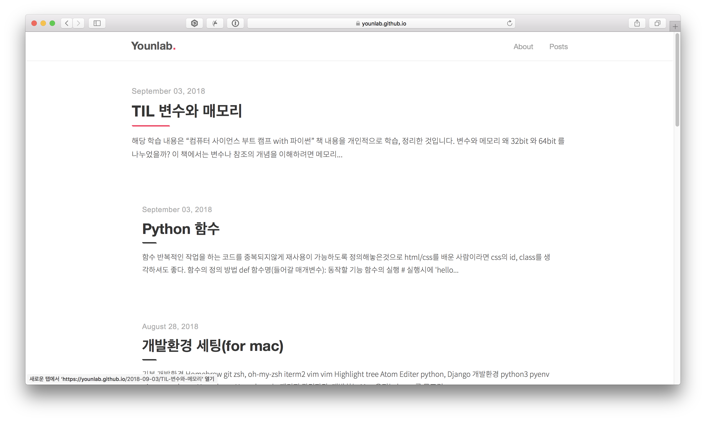

# Younlab dot blog

## Tale theme Custom Blog

[](https://badge.fury.io/rb/tale)



## Features
- Easy installation
- Compatible with GitHub Pages
- Responsive design (looks just as good on mobile)
- Syntax highlighting, with the help of Pygments
- Markdown and HTML text formatting
- Pagination of posts


```bash
$ bundle exec jekyll serve
```

And you're all set! Head over to http://127.0.0.1:4000/ to see your site in action.

## Contributing
Found a bug or have a suggestion? Feel free to create an issue or make a pull request!

## License
See [LICENSE](https://github.com/chesterhow/tale/blob/master/LICENSE)
